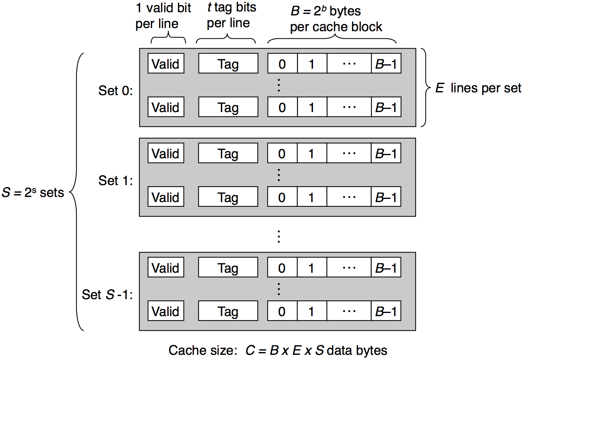
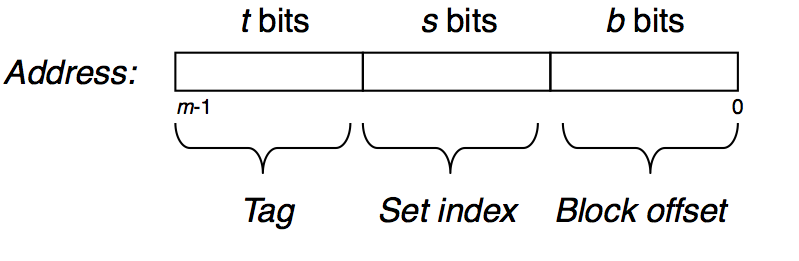

# 3: Cache Organization

There is no code for this activity. It is simply an investigation into how the bits for an address get set up to access a byte in cache. Work out the numbers needed for each cache and keep track of them in a new text file, `responses.txt`.

Work with a partner on the following questions.

Be sure to double-check your work, since it is easy to make small mistakes that can propagate.

--------------

All caches follow this general structure as shown in your book in Figure 6.25:

--------------

A full address to memory must have these elements:

Suppose that we want to determine what the address is for the following real processor. A specification can be found here:

[Intel® Xeon® Processor E5-2697 v4 Specifications](http://www.cpu-world.com/CPUs/Xeon/Intel-Xeon%20E5-2697%20v4.html)

## Enterprise servers can have a lot of memory

Companies like Hewlett Packard can configure servers with very large amounts of memory, such as 1024 Gigabytes (GB). To address each byte of that memory using cache-based addresses, we need to determine what the structure of a cache address would be. 

### Computing the number of address bits

For each of the questions below, begin by stating what the cache size C is, and what the number of lines per set E is. Then use those to determine S, t, s, and b.

To do this, recall this information from presentations and the text, Figure 6.26:

| Parameter            | Description                                 |
|----------------------|---------------------------------------------|
| S = 2s    | Number of sets (S), where s is number of set bits in the address                              |
| E                    | Number of lines per set                     |
| B = 2b    | Block size in bytes                         |
| m = log2M | Number of physical main memory address bits |
|                      |                                             |

| Derived quantity     | Description                                                       |
|----------------------|-------------------------------------------------------------------|
| M = 2m    | Maximum number of unique memory addresses that map to cache              |
| s = log2S | Number of bits needed for the set index portion of the address    |
| b = 2B    | Number of bits needed for the block offset portion of the address |
| t = m - (s + b)      | Number of bits needed for the tag portion of the address          |
| C = B * E * S        | Overall cache size                                                |

### Level 1 cache address bits 
For level 1 cache, note this information on the specification:

- Level 1 cache size:  18 x 32 KB 8-way set associative instruction caches

This processor has 18 cores, so let's simply consider one of them. The "18 x" is signifying all of them. One core simply has 32 KB (kilobytes) of cache. **1 KB is 1024 bytes, also referred to as KiB**.

Q1. For one of the the level 1 caches, per processor, what would the values for the t bits, the s bits, and the b bits be if 1024 GB of memory (the variable M above) was installed on the machine and the cache block size is 64 bytes? 

*Helpful Hints:* 
* M needs to be in terms of bytes. There are 230 bytes in a GB.
* 8-way associative cache means that the number of lines per set (E) is 8. A powers of 2 table will be helpful.

### Level 2 cache address bits 

For the 18 cores on this machine, each has a level 2 cache of size 256 KB, as given in the specification like this:

- Level 2 cache size: 	18 x 256 KB 8-way set associative caches

Consider simply one core's level 2 cache for the following calculations.

Q2. For the level 2 cache, what would the values for the t bits, the s bits, and the b bits be if 1024 GB of memory was installed on the machine and the cache block size is 64 bytes?

## Main Memory and Chip Design

It is interesting to note how current processors have been designed for main memory values that are absurdly unattainable today. For the Xeon processor linked above:

What is the maximum value of the size of main memory, M?

This is a side note of how the CPU manufacturers are preparing for the future.

## Next try a practice problem

The practice problem 6.9 lets you work through this for some smaller caches to illustrate how to work through these equations and determine how bits needed for each part of a memory address that is mapped to cache.
